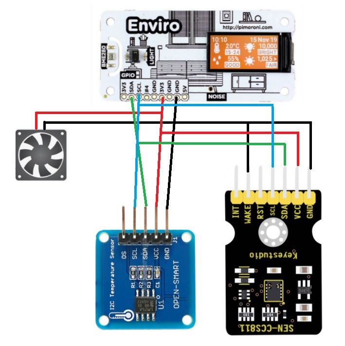

# [Berry_Blob](https://github.com/ThuviksaM/Berry_Blob) 🐍

This repository has all my code for my enviroment monitoring RaspberryPi, named Berry_Blob 😆, you're welcome to explore around it! 🔎
Wanna see the data Berry_Blob gathered? If so, [here](https://io.adafruit.com/Thuviksa/dashboards/weather-monitor) are my AdaFruitIO dashboards. 💻

Thank you so much, [Dr. Thomas Proffen](https://github.com/tproffen) and Amelie Nagle for all the guidance and debugging help, you both are magical. 🦄

<hr>

## A Few Reminders 📆

🔐 ***- Security Warning/Information***
❗ ***- Important Information/Warning***

You will need a [Raspberry Pi Zero W](https://www.raspberrypi.org/products/raspberry-pi-zero-w/) or another [Raspberry Pi](https://www.adafruit.com/?q=Raspberry+Pi&sort=BestMatch), a Pimoroni [Enviro Hat](https://shop.pimoroni.com/products/enviro?variant=31155658489939), an external temperature sensor, a CCS811 sensor, a breadboard ([example](https://www.adafruit.com/product/64)), a cooling fan ([example](https://www.adafruit.com/product/3368)), an unused [Google Account](https://www.google.com), and an [AdaFruit IO](https://io.adafruit.com/) account, if you have all of these materials, you're set 👍, though you also have to connect your Pi to the internet your computer is on, after you get your Pi.

🔐 ***Please notify me if you notice any typos or any other kind of error (you may also [contribute](CONTRIBUTING.md)), or if you want to use the code in any of my MasterMonitor Scripts (I know, they're awesome 😎) - also take a look at this repository's [license](https://github.com/ThuviksaM/Berry_Blob/blob/master/LICENSE.md) - , thanks, I appreciate it. 😄***

<hr>

## [Wiring the Sensors to the Pi 🥧](../Images/sensor-wiring-img.jpg)

Before you program anything you have to wire the sensors up...or nothing will work!
The image below is the wiring diagram [Dr. Proffen](https://github.com/tproffen) used to help me and the others in @orcsgirls wire their sensors up!

❗ ***The intersecting lines (wires) are in the same row on the breadboard.***



<hr>

## [MasterMonitor Sensor Script 🖱️](../JupyterNotebooks/MasterMonitorScript.ipynb)

This is the MasterMonitor Script that controls all the sensor readings and sends them to AdaFruitIO cloud, which then puts the data into my dashboard's visual graphs and charts.

<hr width= "600">

### AdaFruit IO

Make sure you change the AdaFruitIO_Username and the AdaFruitIO_Key variables to your username and key, and remove vvv (except for AdaFruitIO_Username, and AdaFruitIO_Key variables).
```python
from dotenv import load_dotenv
import os

load_dotenv()

AdaFruitIO_Username = os.envrion.get("ADAFRUIT_IO_USERNAME")
AdaFruitIO_Key = os.environ.get("ADAFRUIT_IO_USERNAME")
```
🔐 ***If you share your code somewhere, make sure to keep ^^^, and create a text file named `.env` in the EXACT folder you code/notebook is in to keep your `ADAFRUIT_IO_USERNAME` and `ADAFRUIT_IO_KEY` variables, you might, also, need to dowload the `dotenv` module, here is what you would need to put in a terminal to do that. vvv f If, for some reason, you don't have access to a terminal, you would add a `!` in front of vvv***
```python
pip3 install python-dotenv
```
🔐 ***Here is what you would put in your `.env` text file, of course, replacing `your-username` and `your-key` with your actual username and key. vvv***
```python
ADAFRUIT_IO_USERNAME = "your-username"
ADAFRUIT_IO_KEY = "your-key"
```
🔐 ***DO NOT `git add` the `.env` text file to GitHub.***

❗ ***You can get your key by clicking the 'My Key' tab on the AdaFruitIO website.***

<hr width= "600">

### Google Sheets

🔐 ***Go [here](GOOGLE_SETUP.md) to find important instructions you MUST follow before using ANY code.***

❗ ***Make sure this vvv matches your Google Sheet name.***
```python
sheet_name = "enviro-pi_log"
```

<hr width= "600">

### Main Code

You can change the `time` placeholder in the below code to however long of a break you want your Pi to take before sending data to the AdaFruitIO Cloud.
```python
if time_elapsed == time:
    time_calculation = time.time()
    aio.send_data(co2Feed.key, CO2, metadata)
    aio.send_data(tvocsFeed.key, TVOC, metadata)
    aio.send_data(soundFeed.key, Amps[0], metadata)
    aio.send_data(luxFeed.key, Light, metadata)
    aio.send_data(intTempCfeed.key, InternalC, metadata)
    aio.send_data(intTempFfeed.key, InternalF, metadata)
    aio.send_data(extemp2Feed.key, External2, metadata)
    aio.send_data(extempFeed.key, External, metadata)
    aio.send_data(humidFeed.key, Humidity, metadata)
    aio.send_data(pressFeed.key, Pressure, metadata)
```
You have to also change the `feed-name` placeholders in the below variables to your AdaFruitIO feed names.
```python
soundFeed = getFeed("feed-name")
luxFeed = getFeed("feed-name")
intTempCfeed = getFeed("feed-name")
intTempFfeed = getFeed("feed-name")
extemp2Feed = getFeed("feed-name")
extempFeed = getFeed("feed-name")
humidFeed = getFeed("feed-name")
pressFeed = getFeed("feed-name")
tvocsFeed = getFeed("feed-name")
co2Feed = getFeed("feed-name")
```
❗ ***Make sure you make a seperate AdaFruit IO feed for each of the variables.***

`intTempCfeed` and `intTempFfeed` variables are optional, so you can delete them, they just show the actual temperature of your Pi, and since the `intTempCfeed` and `intTempFfeed` variables are optional,
```python   
InternalC = Celcius - External
InternalF = Fahrenheit - External2
```
in
```python
Amps = noise.get_amplitudes_at_frequency_ranges(range)
Light = ltr559.get_lux()
External = readTemp()
External2 = External * 1.8 + 32
Celcius = bme280.get_temperature()
Fahrenheit = Celcius * 1.8 + 32
InternalC = Celcius - External
InternalF = Fahrenheit - External2
Humidity = bme280.get_humidity()
Pressure = bme280.get_pressure()
CO2 = ccs.eco2
TVOC = ccs.tvoc
```
and
```python
aio.send_data(intTempCfeed.key, InternalC, metadata)
aio.send_data(intTempFfeed.key, InternalF, metadata)
```
in
```python
time_calculation = time.time()
aio.send_data(co2Feed.key, CO2, metadata)
aio.send_data(tvocsFeed.key, TVOC, metadata)
aio.send_data(soundFeed.key, Amps[0], metadata)
aio.send_data(luxFeed.key, Light, metadata)
aio.send_data(intTempCfeed.key, InternalC, metadata)
aio.send_data(intTempFfeed.key, InternalF, metadata)
aio.send_data(extemp2Feed.key, External2, metadata)
aio.send_data(extempFeed.key, External, metadata)
aio.send_data(humidFeed.key, Humidity, metadata)
aio.send_data(pressFeed.key, Pressure, metadata)
time_elapsed = time.time() - time_calculation
```
are optional, too.

<hr>

## [MasterMonitor GIF Display Script 🖼️](../JupyterNotebooks/MasterMonitorGIFDisplayScript.ipynb)

This MasterMonitor Script has the exact code you need to make a cute GIF appear on your display!

You can change the code below if you want to make a GIF other than the [Party_Blob](../JupyterNotebooks/part_blob.gif) appear on your display.
```python
image_file = "party_blob.gif"
```
❗ ***Make sure your GIF file is in the SAME folder your code/notebook is in.***

You can also edit or keep the print statements in this code vvv.
```python
image = Image.open(image_file)
print("Party_Blob is SO cute!!!")
print("Drawing GIF, Stop This Cell To Exit!")
```

<hr>

### Check out my [@orcsgirls](https://github.com/orcsgirls) teammates' enviroment monitoring and other super-cool code, they're awesome! 😎
 - [github.com/apzzd/EnviroPi](https://github.com/apzzd/EnviroPi) - [Ada's](https://github.com/apzzd) code 
 - [github.com/JaVaLemn/EnviroPi](https://github.com/JaVaLemn/EnviroPi) - [Katie's](https://github.com/JaVaLemn) code 
 - [github.com/tproffen/AirMonitoringEnviro](https://github.com/tproffen/AirMonitoringEnviro) - [Dr. Proffen's](https://github.com/tproffen) code -- the actual master-code</p>
